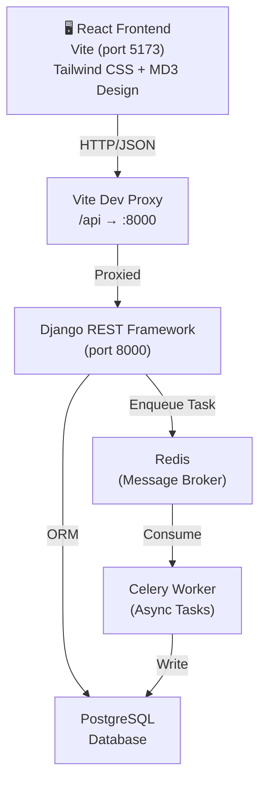

# Luminous Vault — Credit Approval System


A full-stack **Credit Approval System** with a premium **"Luminous Vault"** UI — built on a **Django REST API** backend and a **Vite + React + Tailwind CSS** frontend. The system handles customer onboarding, 4-factor credit scoring, loan eligibility evaluation, automated rate correction, loan disbursement, and full portfolio history — all wrapped in a Material Design 3 dark-green glassmorphism interface.

---

## 📐 Architecture



---

## ✨ Features

| Feature | Description |
|---|---|
| **Customer Registration** | Auto-computes credit limit as `36 × monthly income`, rounded to nearest lakh |
| **4-Factor Credit Score** | Weighted model: payment history (40%), loan count (20%), current-year activity (20%), utilization (20%) |
| **Loan Eligibility Check** | Evaluates credit score slabs + EMI affordability (≤ 50% of salary) |
| **Interest Rate Correction** | Automatically adjusts rate to slab minimum if requested rate is too low |
| **Loan Disbursement** | Creates loans with auto-assigned IDs and precise EMI calculation |
| **Loan History** | Per-loan detail or full customer portfolio with repayment progress bars |
| **Async Data Import** | Celery tasks ingest `customer_data.xlsx` and `loan_data.xlsx` on startup |
| **Luminous Vault UI** | Material Design 3 dark-green glassmorphism frontend — sticky nav, animated score ring, mobile bottom nav |

---

## 🖼️ UI — Luminous Vault Design

The frontend uses a premium **Material Design 3** dark theme with:

- **Background:** `#001205` deep forest green
- **Primary:** `#81fd77` vivid green — buttons, active states, highlights
- **Glassmorphism panels:** `rgba(47,52,69,0.4)` + `backdrop-filter: blur(12px)`
- **Sticky navbar** with indigo/violet `Luminous Vault` gradient wordmark
- **Two-column layout** (7/5 grid) on Loan Application and Eligibility pages — exact replica of the design mockup
- **Animated SVG credit score ring** with color-coded slab labels
- **Green gradient repayment progress bars** on loan portfolio view
- **Mobile bottom navigation** (4-tab fixed bar)
- **Material Symbols** icon system throughout

---

## 🗂️ Project Structure

```
Credit-Approval-System/
├── credit_system/              # Django project settings & config
│   ├── settings.py
│   ├── urls.py
│   └── celery.py               # Celery app configuration
├── loans/                      # Core Django app
│   ├── constants.py            # ★ Single source of truth for all domain literals
│   ├── models.py               # Customer & Loan models
│   ├── serializers.py          # DRF serializers (shared LoanRequestSerializer)
│   ├── views.py                # API views + get_customer_or_404() helper
│   ├── services.py             # Credit score, EMI, eligibility (fully type-hinted)
│   ├── tasks.py                # Celery async data ingestion (safe_decimal helper)
│   ├── tests.py                # 11 unit + integration tests
│   └── urls.py                 # App URL routing
├── data/
│   ├── customer_data.xlsx      # Seed data: 300 customers
│   └── loan_data.xlsx          # Seed data: 1000 loans
├── frontend/                   # Vite + React + Tailwind CSS
│   ├── src/
│   │   ├── api/client.js       # Axios client (all 5 endpoints)
│   │   ├── hooks/
│   │   │   └── useApiForm.js   # ★ Shared form state hook
│   │   ├── components/
│   │   │   ├── Navbar.jsx      # Glassmorphism sticky navbar
│   │   │   ├── BottomNav.jsx   # Mobile 4-tab bottom nav
│   │   │   └── ErrorPanel.jsx  # Shared error display component
│   │   ├── pages/
│   │   │   ├── Dashboard.jsx
│   │   │   ├── RegisterCustomer.jsx
│   │   │   ├── CheckEligibility.jsx   # Two-column layout + score ring
│   │   │   ├── CreateLoan.jsx         # Two-column layout + result panel
│   │   │   ├── ViewLoan.jsx
│   │   │   └── ViewCustomerLoans.jsx  # Progress bars + stats
│   │   ├── App.jsx
│   │   ├── main.jsx
│   │   └── index.css           # Tailwind directives + .glass-panel, .lv-btn, etc.
│   ├── tailwind.config.cjs     # Full MD3 color system
│   ├── postcss.config.cjs
│   └── vite.config.js          # Proxy: /api → localhost:8000
├── scripts/
│   └── entrypoint.sh           # Docker entrypoint
├── Dockerfile
├── docker-compose.yml
└── requirements.txt
```

---

## 🚀 Quick Start

### Option A — Docker Compose (Recommended)

> Requires [Docker Desktop](https://www.docker.com/products/docker-desktop/)

```bash
# 1. Clone the repo
git clone https://github.com/sharma614/Credit-Approval-System.git
cd Credit-Approval-System

# 2. Start all services (Django + PostgreSQL + Redis + Celery Worker)
docker compose up --build

# 3. In a new terminal, start the React frontend
cd frontend
npm install
npm run dev
```

Open **http://localhost:5173** in your browser.

---

### Option B — Local Development (Manual)

#### Prerequisites
- Python 3.11+
- PostgreSQL 15+
- Redis 7+
- Node.js 18+

#### Backend Setup

```bash
# Create & activate a virtual environment
python -m venv venv
venv\Scripts\activate          # Windows
source venv/bin/activate        # Linux/macOS

# Install Python dependencies
pip install -r requirements.txt

# Configure env vars (or create a .env file)
set POSTGRES_DB=credit_user
set POSTGRES_USER=credit_user
set POSTGRES_PASSWORD=credit_password
set POSTGRES_HOST=localhost

# Apply migrations
python manage.py migrate

# Start Celery worker (loads seed data from Excel on startup)
celery -A credit_system worker --loglevel=info

# In a separate terminal — run Django dev server
python manage.py runserver
```

#### Frontend Setup

```bash
cd frontend
npm install
npm run dev
```

> The Vite dev server runs on **http://localhost:5173** and proxies `/api/*` calls to Django at `http://localhost:8000`.

---

## 🔌 API Reference

Base URL: `http://localhost:8000`

All endpoints return JSON. Auto-generated IDs must not be passed in request bodies.

### POST `/api/register/`
Register a new customer.

**Request:**
```json
{
  "first_name": "John",
  "last_name": "Doe",
  "age": 30,
  "monthly_income": 60000,
  "phone_number": 9876543210
}
```

**Response:** Customer record including auto-generated `customer_id` and computed `approved_limit` (`36 × monthly_income`, rounded to nearest ₹1,00,000).

---

### POST `/api/check-eligibility/`
Evaluate loan eligibility without creating a loan.

**Request:**
```json
{
  "customer_id": 302,
  "loan_amount": 500000,
  "interest_rate": 10,
  "tenure": 24
}
```

**Response:**
```json
{
  "customer_id": 302,
  "approval": true,
  "interest_rate": 10,
  "corrected_interest_rate": 12,
  "tenure": 24,
  "monthly_installment": 23536.72
}
```

---

### POST `/api/create-loan/`
Create and disburse a loan (runs eligibility check internally).

**Request:** Same 4 fields as `/check-eligibility/`.

**Response:**
```json
{
  "loan_id": 9997,
  "customer_id": 302,
  "loan_approved": true,
  "message": "Loan approved",
  "monthly_installment": 23536.72
}
```

---

### GET `/api/view-loan/{loan_id}/`
Retrieve full loan details with nested customer profile.

**Response:**
```json
{
  "loan_id": 9997,
  "customer": {
    "id": 302,
    "first_name": "John",
    "last_name": "Doe",
    "phone_number": 9876543210,
    "age": 30
  },
  "loan_amount": "500000.00",
  "interest_rate": "12.00",
  "monthly_installment": "23536.72",
  "tenure": 24
}
```

---

### GET `/api/view-loans/{customer_id}/`
List all loans for a customer with repayment tracking.

**Response:**
```json
[
  {
    "loan_id": 9997,
    "loan_amount": "500000.00",
    "interest_rate": "12.00",
    "monthly_installment": "23536.72",
    "repayments_left": 18,
    "tenure": 24
  }
]
```

---

### Error Responses

| Scenario | HTTP Status | Response |
|---|---|---|
| Customer / Loan not found | `404` | `{"error": "Customer not found"}` |
| Invalid input fields | `400` | Field-level error object |
| EMI affordability failure | `200` | `approval: false` |
| Credit score too low | `200` | `approval: false` |

---

## 🧮 Credit Score Algorithm

Score (0–100) is computed from four weighted factors:

```
Score = Payment History (40pts)
      + Loan Count (20pts)
      + Current-Year Activity (20pts)
      + Credit Utilisation (20pts)
```

**Slab → Decision:**

| Score | Decision | Min Interest Rate |
|---|---|---|
| > 50 | ✅ Approved | As requested |
| 30 – 50 | ✅ Approved | 12% |
| 10 – 30 | ✅ Approved | 16% |
| < 10 | ❌ Rejected | — |

> **Affordability gate:** Even with a passing score, the loan is rejected if `(existing EMIs + proposed EMI) > 50%` of monthly salary.

> **Overlimit gate:** If current outstanding > approved credit limit, score is forced to **0**.

All thresholds live in [`loans/constants.py`](loans/constants.py) — never duplicated across files.

---

## 🧑‍💻 Code Quality Highlights

This codebase was refactored through a 7-track quality pass:

| Track | What was done |
|---|---|
| **DRY — Backend** | `get_customer_or_404()` helper; `_safe_decimal()` in tasks; merged duplicate serializers into `LoanRequestSerializer` |
| **DRY — Frontend** | `useApiForm` hook; `<ErrorPanel />` component; `navLinkClass` + `NAV_ITEMS` in navbar |
| **Constants** | All domain literals centralised in `loans/constants.py` |
| **Type hints** | Full Python type annotations on all service/view/task methods |
| **Bug fix** | `paidPct` was silently `NaN` — `tenure` was missing from `CustomerLoanSerializer`. Fixed in serializer + frontend guard. |
| **Dead code** | Removed unused `recharts` dep, `import json`, 5 dead CSS classes, redundant `total_emis` property |
| **Exception safety** | Narrowed `except Exception` → `except (ValueError, KeyError)` in Celery task |

---

## 🧪 Sample Test Flow

1. **Register** a customer → capture `customer_id`
2. **Check Eligibility** with `customer_id`, `loan_amount`, `interest_rate`, `tenure` → note `corrected_interest_rate`
3. **Create Loan** (if eligible) → capture `loan_id`
4. **View Loan** by `loan_id` → verify full loan + customer details
5. **View Customer Loans** by `customer_id` → see portfolio with repayment progress

---

## 🧩 Tech Stack

| Layer | Technology |
|---|---|
| Backend Framework | Django 4.2 + Django REST Framework 3.14 |
| Database | PostgreSQL 15 |
| Task Queue | Celery 5.3 |
| Message Broker | Redis 7 |
| Data Processing | Pandas + OpenPyXL (Excel ingestion) |
| Frontend | React 19 + Vite 8 |
| Styling | Tailwind CSS v3 + Material Design 3 color system |
| Routing | React Router v7 |
| HTTP Client | Axios |
| Icons | Material Symbols (Google Fonts) |
| Containerization | Docker + Docker Compose |

---

## 🐳 Docker Services

| Service | Image | Port |
|---|---|---|
| `web` | Django (Gunicorn) | 8000 |
| `db` | postgres:15 | 5432 |
| `redis` | redis:7 | 6379 |
| `celery` | Same as web | — |

---

## 📄 License

MIT — feel free to fork and extend.
